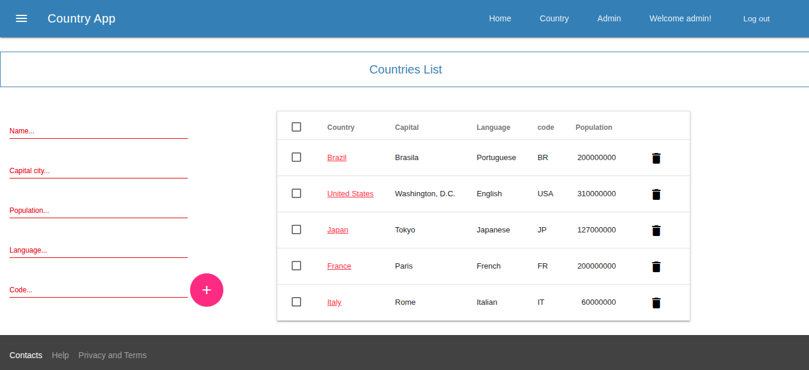

# Spring Boot MVC with Thymeleaf and Material Design Lite

Source author [https://github.com/JFelipeP/spring-boot-mdl.git](https://github.com/JFelipeP/spring-boot-mdl.git).

This is an example of Spring Boot MVC with Thymeleaf as its view technology styled with Material Design Lite, an implementation of the Material Design concept created by Google.

Used:
Java 8
Spring Boot 1.5.3.RELEASE
H2 database
thymeleaf
 
## Requirements

- Java 1.8 [set_java.sh](set_java.sh)
- Gradle
- NPM
- Bower

For Node.js/NPM installation visit [https://nodejs.org]. 

Install bower:
 
 ```npm install -g bower```
 
## Running
Install required bower components:

```bower install```

Start the application locally by running:
 
````shell
./gradlew bootRun
````

Or:

```gradle run```

Open [http://localhost:8080] in your browser.

## Login Credentials
    username: user
    password: user
    or
    username: admin
    password: admin





## Build

````shell
./gradlew build
````

name of build setting in build.gradle:

````shell
jar {
	baseName = 'mdl'
	version = '0.0.1-SNAPSHOT'
}
````

Run built jar:

````shell
/usr/lib/jvm/java-1.8.0-openjdk-amd64/bin/java -jar build/libs/mdl-0.0.1-SNAPSHOT.jar
````

## Other

Run ONE test from console:

````shell
./gradlew test --tests "material.design.controller.CountryControllerMvcTest"
````

Test with __MOCK USER__ CountryControllerMvcTest.java [CountryControllerMvcTest.java](src/test/java/material/design/controller/CountryControllerMvcTest.java):

````java
    @WithMockUser(value = "user") // <---------------------MOCK USER
    @Test
    public void getCountryOk() throws Exception {
        List<Country> countries = new ArrayList<>();
        Country country = new Country();
        country.setId(1L);
        countries.add(country);
        when(repository.findAll()).thenReturn(countries);
        this.mockMvc.perform(get("/country")).andDo(print()).andExpect(status().isOk());
    }
````

## Links

[Understanding Spring MVC](https://www.codejava.net/frameworks/spring/understanding-spring-mvc)
[How to create a Spring Boot Web Application (Spring MVC with JSP/ThymeLeaf)](https://www.codejava.net/frameworks/spring-boot/how-to-create-a-spring-boot-web-application-spring-mvc-with-jsp-thymeleaf)
[Introduction to Using Thymeleaf in Spring (baeldung)](https://www.baeldung.com/thymeleaf-in-spring-mvc)
[Практика: интеграция Thymeleaf для генерации HTML-страниц (javarush)](https://javarush.com/quests/lectures/ru.javarush.java.spring.lecture.level07.lecture08)